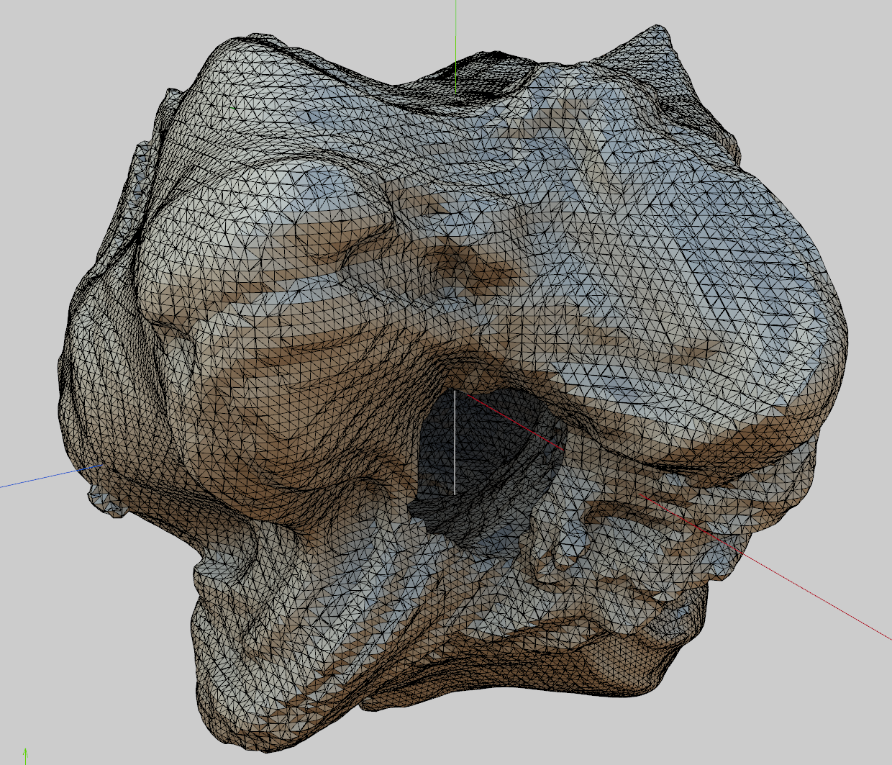

# osino - An Open Simplex Noise implementation for Enoki/CUDA.

This is an Enoki-port of the [OpenSimplex.java code by Stefan Gustavson](http://webstaff.itn.liu.se/~stegu/simplexnoise/SimplexNoise.java).

## License
3-clause BSD

## Dependencies
* Enoki
* CUDA
* ThreadTracer

## Building

Install cuda development environment. I used /usr/local/cuda for the destination.

Get the source and dependencies, recursively:

```
$ git clone --recursive git@github.com:stolk/osino.git
```

Build enoki:

```
$ cd externals/enoki
$ mkdir build
$ cd build
$ CXX=clang++-8 CC=clang-8 cmake -DCMAKE_CUDA_COMPILER=/usr/local/cuda/bin/nvcc -DCMAKE_BUILD_TYPE=Debug -DENOKI_CUDA=ON ..
$ make
$ cd ../../..
```

Before building osino, edit the Makefile to set your compiler.
Then use `make` to build the example.

Test osino:
```
$ make output.obj
```




